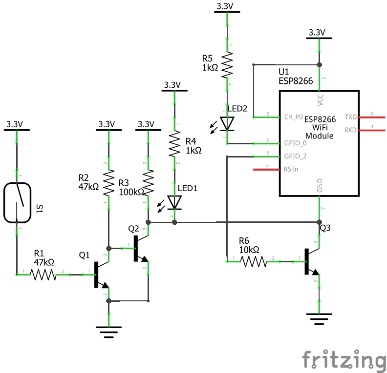

# MQTT_Mailbox-_Doorsensor

A MQTT Door- or Mailboxsensor using an ESP8266 Wifi Module, which notifies you if you receive a Letter or someone opens the Door

# How it Works
If the mailbox opens the ESP wakes up from deep-sleep, connects to Wifi and the MQTT-server and sents out a MQTT message, which is then processed by Node-Red. Node-Red however "converts" it into a Matrix message, which is then posted to my phone via a Matrix-Chatbot.
## You Can find the Instructions how to create the Chatbot in the [node-red-Folder](node-red/README.md).

As a switch I used a magentic REED-switch, which CLOSES if a magnet gets close to it. This was the first problem because when the mailbox is closed (which is the case for the most time) the reedswitch is also closed. If we now want to get notified when the mailbox opens we need to use the opening reedswitch as a trigger to send the message.

The Sensor is powered by a LiFePo4 Battery and therefor it must draw verry little Power while doing nothing to guarantee a long battery lifetime.

For those two problems I came up with two ideas:

# First Idea - FAIL
My fist idea was to cut off the power of the ESP while the Mailbox is closed so it doesn´t draw any power. To do this I used a Transistor in series with the ESP which can be bypassed by the switch. I was inspired by Andreas Spiess´s [video](https://youtu.be/Kvl-mR5gldw?t=1242). He explains in this video how to do just that.
However there was another probem because the reedswitch in my configuration was normally closed. I needed to assing two transistor in the following configuration to create a normally high singal:
 

However this idea didn´t work out, because the transistor was not able to keep the ESP powered on as long as it sends the data, so i came up with another idea:

# Second idea - Better, but still not good
I simply connected the normally high singal of the transistors directly to the resetpin of the ESP. If the reedswitch opens the resetpin is pulled low, which resets the ESP. After the reset it boots up, sends out the data and goes to deep sleep, when finished. This way the power consumption was verry low. 

But there was one problem: Sometimes the post man doesn´t throw the newspaper all the way in to the mailbox, wich causes a opened mail slot and consequently an always opened reedswitch. This caues, that the resetpin is pulled low continously. This leads to a realetively high current draw, wich would drain the battery quiet fast.
So I needed to get rid of this problem to:

# Third idea - IT Works!!
I needed to create a pulse trigger singal, when the mailbox gets opened and if it stays opend, the reedswitch-signal doesn´t stay low, and goes high again after a short period of time.
To get this result I used the following FINAL schematic:

The signal at the resetpin, when the reedswitch opens looks like that. By varying the value of the capacitor you can also change the pulse length:

# The code
The code is verry simple: After a reset it connects to wifi and an MQTT server where it publishes a message. After that it causes the ESP to enter an infinite deep sleep, which can only be interrupted by another reset of the ESP board. I used an ESP8266 Wifi Module but the code should work with any other ESP too. 

All the processing of the message is done on the MQTT server/Node Red.

# Power consumption
The powerconsumtion of the circuit looks like that:
    - 70mA while the ESP is active (and sending out data)
    - 0.2mA with the ESP in Deep-Sleep and the reedswitch closed
    - (0.04mA  with the ESP in Deep-Sleep and the reedswitch opend)

The circuit can be connected to the LiFePo4 battery directly without any voltage regulation because the nominal voltage of the battery is around 3.3V.

To power the circuit I use a LiFePo4 bettery of the type **IFR18650** with a capacity of 1400mAH (4.48Wh).
So in theory this should give an approximate runtime of 9 months!!

This work by Dustin Brunner is licensed under <a rel="license" href="https://creativecommons.org/licenses/by/4.0">CC BY 4.0</a>

 Dieses Werk von Dustin Brunner ist lizenziert unter einer <a rel="license" href="http://creativecommons.org/licenses/by/4.0/">Creative Commons Namensnennung 4.0 International Lizenz</a>.
