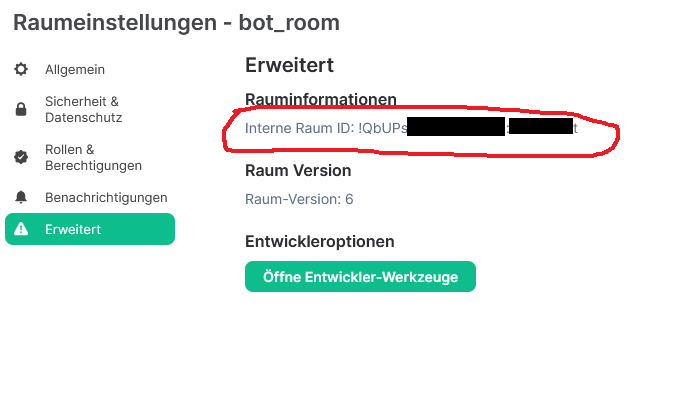
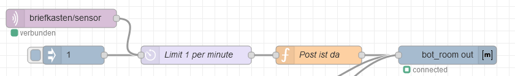
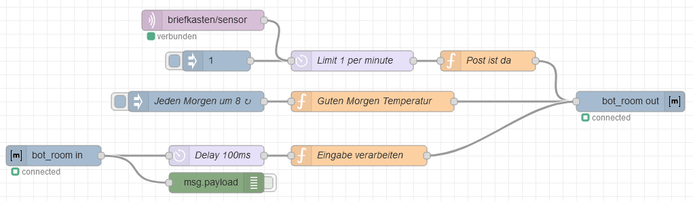

# Integration in Node Red / Node-Red Matrix Chatbot

This is a follow-up Article of the MQTT Mailbox-Doorsensor-Project.

I want to show you how you can integrate the Doorsensor into Node-Red, where it triggers a Matrix Chatbot, which is then sending you a Message, that you have got a letter in the mailbox.

If you didn’t already have a Matrix-Server, I recommend you to read my article about setting up a [Matrix Chatserver using Docker](https://www.brunweb.de/eigener-matrix-homeserver-mit-docker-einrichten/) (in German).

The Mailbox-Sensor is programmed in a way, that it publishes a MQTT-message on a specific topic, whenever the mailbox gets opened. Node Red is processing the message and sending out a message into a Matrix-Chatroom.

# 1. Setup Bot-User on the Matrix server

You first have to create a specific user on your matrix-server, that is only used by the bot. Name it as you want. If you have followed my Matrix-server setup instructions, you can do that in the synapse-admin webpanel.

Now you need to create a Chatroom for you and the Bot (The Personal chat with the bot is not working, due to End-to-End encryption). You can create this room with your personal account on the Matrix-server. Make sure to NOT enable room encryption. Now invite the Bot-user into the room.

After that login into the element-webpanel with your newly created bot-user and accept the invitation into the room.

# 2. Setup Node-Red

To configure the bot in Node-Red you first need to find out the Room-ID of your bot-room. For that click on the little „i“ in the top right corner of the element-webpanel. Then click on „room-properties“ and in the „advanced“ tab, you find the „Internal Room ID“. Copy it because you will need it later.

In Node Red you first need to download the Node „node-red-contrib-matrix“. (There is also the „node-red-contrib-matrixbot“ Node availible, but this did **not** work for me because it wont connect to my matrix server).

Now you can import my flow, which is the file: `matrix-doorsensor-flow.json`.

You need to configure the „bot_room out“-Node: Fill your previously copied room-id into the „Room“ field. Then click on the server-field, where you need to fill in your server-address. Dont fill the User-Token field by yourself. Instead fill in the username and password of your bot-user and click on the little arrow in the „Generate Token“ tab. This will create a user-token for you. If you ever have connectivity problems to your matrix-server, just delete the Token from the token field and generate a new one like described earlier.

You can test if your configuration is working by clicking on the inject „1“- node. You should receive a message in your bot-room.

If it does not work make sure that the bot-user is not logged in on the element-webpanel anymore. I have noticed, that the when I login the bot-user on any other client, the generated access token is not valid anymore. If this happens just create a new one and you will be fine :).

# Going further

You can expand your bot by adding an input-node to the mix. Now you can text commands into the bot-room and the bot answers to them.

In my configuration I added a opportunity to Request the current weather from my weatherstation. Also the bot textes me at 8 o’clock in the morning automatically the current temperature.

My complete flow looks like this:

You can download it, it is the File: `matrix-chatbot.json` from Mailbox-Doorsensor Repository.

 
 

This work by Dustin Brunner is licensed under <a rel="license" href="https://creativecommons.org/licenses/by/4.0">CC BY 4.0</a>

 Dieses Werk von Dustin Brunner ist lizenziert unter einer <a rel="license" href="http://creativecommons.org/licenses/by/4.0/">Creative Commons Namensnennung 4.0 International Lizenz</a>.
